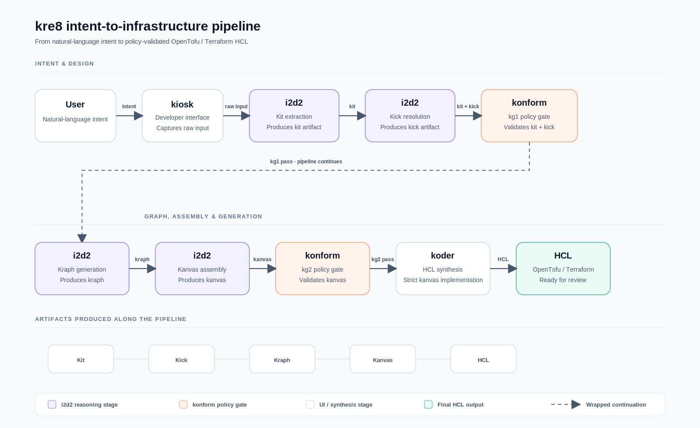
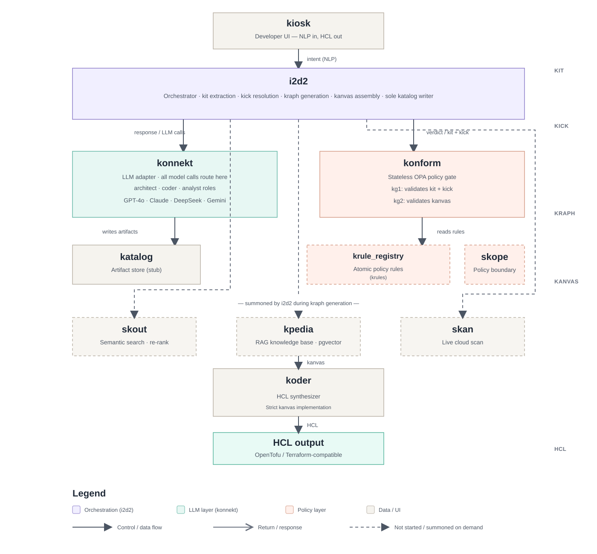

# kre8 — Intent to Infra

> ⚠️ **Work in Progress** — kre8 is under active development. Core schemas and the LLM adapter are done; the i2d2 orchestrator is in progress. Most pipeline components are not yet implemented. Not ready for production use.

---

## What is kre8?

**kre8** is a **Thinking Infrastructure Engine (TIE)** — it translates natural language infrastructure intent into validated, policy-aware design decisions and executable HCL.

At its core is **i2d2** (Intelligent Infrastructure Design Decision) — the reasoning engine that drives the full pipeline from intent extraction through to HCL synthesis. The key design principle: kre8 produces a structured, inspectable design artifact (kanvas) that is policy-validated before a single line of HCL is written. The design is the deliverable — not the Terraform.

This matters because most IaC generation workflows are opaque: intent goes in, code comes out, and there is no inspectable record of what decisions were made, what policies were applied, or why the design looks the way it does. kre8 makes every design decision a first-class artifact with a traceable provenance — from the raw intent signals in Kit, through policy resolution in kick, through the resource dependency graph in kraph, to the full infrastructure manifest in kanvas. Every stage is stored, every gate verdict travels with the artifact, and konform enforces policy at two explicit checkpoints before any code is synthesised.

---

## How it works

The pipeline runs in two phases separated by mandatory policy gates:

**Intent phase**
1. **Kit** — i2d2 extracts intent signals from natural language as-is, never normalizing. Kit is a standalone artifact with its own ID, reusable across policy environments (skopes).
2. **kick** — i2d2 reads krule_registry and resolves the applicable policy rules for this run. kick binds a Kit ID to a set of krule IDs.
3. **konform (kg1)** — first policy gate. Kit + kick validated against krule_registry before any design work begins. Pipeline halts on failure.

**Design phase**
4. **kraph** — i2d2 reasons over Kit + kick to produce a resource dependency graph. DAG-validated by Pydantic at construction time. skout (semantic search over prior designs) and skan (live cloud state) are summoned as needed and their findings recorded in kraph.references. Mermaid DSL generated deterministically and stored with the graph.
5. **kanvas** — i2d2 resolves provider-specific config values and assembles the full infrastructure manifest. kanvas is always stored in katalog regardless of what follows — the gate verdict travels with it.
6. **konform (kg2)** — second policy gate. Full design validated against krule_registry. Violations recorded in design_conflicts[]; kanvas is stored regardless of outcome.
7. **koder** — synthesizes OpenTofu/Terraform-compatible HCL strictly from the validated kanvas. No independent design judgment.

---

## Architecture

The full component map — all 13 components, artifact flows, LLM call paths, policy boundaries, and active build frame. See [docs/architecture.md](docs/architecture.md) for the written version.

**Key design boundaries:**
- **i2d2** is the sole design authority and the only component that writes to katalog
- **konform** is a pure stateless judge — verdict only, never writes, never designs
- **konnekt** is the only path to any LLM — model strings live here and nowhere else
- **krules** are fully independent atomic policy units, reusable across skopes without modification
- All LLM output is Pydantic-validated before passing downstream — no raw strings

---

## Current State

| Component | Status | Notes |
|---|---|---|
| konnekt | ✅ Done | Full LLM adapter — 5-family MODEL_REGISTRY, ROLE_DEFAULTS, GCP Secret Manager, DeepSeek fallback |
| Kit schema | ✅ Done | 14 signal categories, IntentType, standalone artifact with its own ID — `i2d2/schemas.py` |
| Kraph schema | ✅ Done | DAG validation, layer model, depends_on, TrailEntry, Mermaid DSL field — `i2d2/schemas.py` |
| Kanvas schema | ✅ Done | GateVerdict, DesignConflicts, full manifest model — `i2d2/schemas.py` |
| i2d2 | 🔄 In progress | FastAPI live (`/health` + `POST /process`), Kit extraction wired; kick resolution and kanvas assembly owned directly by i2d2; koder not yet called |
| katalog | ⬜ Planned | In-memory stub — artifact store for Kit, kick, kraph, kanvas, HCL |
| kiosk | ⬜ Planned | Developer UI — NLP in, HCL out; katalog browser; skan diagram rendering |
| koder | ⬜ Planned | HCL synthesizer — strict implementer of kanvas, no independent design judgment |
| konform | ⬜ Planned | OPA/Rego policy gate — kg1 and kg2 checkpoints |
| krule_registry | ⬜ Planned | Atomic policy rule store — DEAL model (Deny / Allow+Limit) |
| skope | ⬜ Planned | Named policy boundary — thin, behaviour defined entirely by assigned krules |
| skout | ⬜ Planned | Semantic search + re-ranking over kpedia for pre-kraph design context |
| skan | ⬜ Planned | Live cloud state scanner (Steampipe) — design context for MODIFY intent |
| kpedia | ⬜ Planned | RAG knowledge base — AWS/GCP pillars, provider docs, skan findings (pgvector) |
| konsole | ⬜ Planned | Admin UI — krule authoring, skope management, conflict surfacing |

---

## Policy model

kre8's policy system is built around **krules** — atomic, skope-independent policy rules using a DEAL model:

- **Deny** — hard-blocks a resource, service, or attribute. No exceptions at the krule level.
- **Allow + Limit** — explicitly permits a resource or pattern within defined bounds. An Allow without a Limit is invalid and rejected at authoring time.

krules are assigned to **skopes** — named policy boundaries. The same Kit can be re-resolved under a different skope; policy is never inherited from a prior run. i2d2 designs freely using full LLM reasoning capability — krules constrain at gate time (konform), not at design time. This preserves reasoning quality and avoids a brittle closed-world default.

---

## Documentation

- [Architecture](docs/architecture.md) — full pipeline, design principles, component build state
- [Components](docs/components.md) — complete component registry with roles, dependencies, and status
- [Schemas](docs/schemas.md) — Kit, Kraph, Kanvas schema reference
- [ADRs](docs/decisions/README.md) — architecture decision records

---

## Tech Stack

- Python 3.11+ · Pydantic v2 · FastAPI
- LLM routing via [LiteLLM](https://github.com/BerriAI/litellm) (konnekt) — OpenAI, Anthropic, Google, DeepSeek, Groq
- Policy enforcement via [OPA](https://www.openpolicyagent.org/) + Rego (konform — planned)
- Cloud scanning via [Steampipe](https://steampipe.io/) (skan — planned)
- HCL output: OpenTofu / Terraform-compatible

---

**GitHub:** [klokworkai/kre8](https://github.com/klokworkai/kre8)

  

